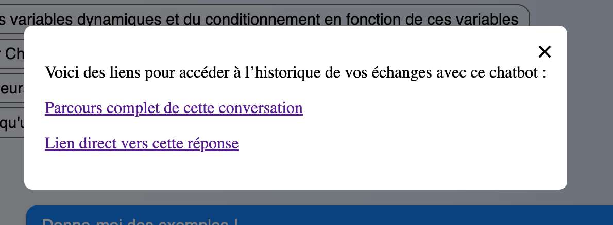

# ChatMD <aside>Manuel d'utilisation</aside>


 {.center}

[ChatMD](https://chatmd.forge.apps.education.fr/) est un outil libre et gratuit qui permet de créer facilement un chatbot personnalisé à partir d'un simple fichier en Markdown.

:::info ✨ Les Fonctionnalités clés

**Simplicité**
- Créez un chatbot en quelques minutes grâce à une syntaxe facile à apprendre
- Utilisation directe en ligne : aucune installation serveur nécessaire

**Personnalisation et flexibilité**
- Interface entièrement configurable
- Syntaxe étendue (variables, conditions, etc.) pour concevoir des chatbots plus avancés

**Intégration possible de l'IA**
- Pas d'IA par défaut, mais possibilité de l'intégrer de manière sobre et ciblée
- Support du <abbr title="Retrieval-Augmented Generation">RAG</abbr> : ajout de bases de connaissances pour des réponses IA plus précises

**Compatibilité RGPD**
- Mode sans IA (par défaut) ou avec IA en local :
	- pas de compte à créer
	- pas de collecte de données personnelles
- Avec IA en ligne :
	- nécessité de créer un compte pour le créateur du chatbot : accès à l'IA avec <abbr title="mot de passe pour pouvoir interroger un LLM et obtenir une réponse">clé API</abbr>
	- pas besoin de compte pour l'utilisateur
	- ⚠️ collecte de données possible (selon le fournisseur du service IA)

**Code optimisé et écoresponsable**
- Code très léger, rapide et à faible empreinte carbone (note A+)
- 100 % sur tous les indicateurs Lighthouse
- 100 % de réussite aux tests automatisés d'accessibilité (en attente pour un audit complet)
:::

## Principe général

#### Principe de fonctionnement
:::info C'est très simple !
1. Créez un fichier en Markdown accessible en ligne.
2. Respectez la syntaxe de ChatMD pour définir votre chatbot.
3. Votre chatbot est alors accessible à l'adresse suivante : `https://chatmd.forge.apps.education.fr/#URL`


<label for="redirect">Collez ici l'URL de votre fichier et cliquez sur “OK” pour accéder à votre chatbot :</label>
<input type="url" id="redirect" class="redirect-input" placeholder="Votre URL" role="textbox" title="Votre URL" style="width:75%" data-base-url="chatmd.forge.apps.education.fr"> <button class="redirect-button" data-input-id="redirect" type="button">OK</button>

:::


#### Cas d'usages

On peut imaginer de nombreux usages :
- Réponse à des questions fréquentes (FAQ)
- Tutoriel pour un outil informatique
- Aide à la décision ou à la création
- Guide méthodologique
- Révision de connaissances, quiz interactif
- Outil de formation, d'aide méthodologique ou de découverte d'un sujet
- Discussion avec un personnage historique
- Histoire dont vous êtes le héros
- Escape game, enquête …

ChatMD peut même intégrer de la géolocalisation, ce qui permet d'autres usages :
- Jeu de piste
- Visite scolaire augmentée 
- Recommandations fondées sur la position de l'utilisateur


La syntaxe de base est simple, mais [ChatMD](https://chatmd.forge.apps.education.fr/) peut être configuré pour des **usages plus complexes** : personnalisation de l'interface, utilisation de variables, de choix aléatoires, intégration avec un LLM, possibilité de faire du RAG…

#### Utiliser ChatMD ?

Par rapport à d'autres solutions qui proposent de créer, avec de l'IA, un chatbot en quelques clics, ChatMD propose une approche différente.

##### Une prise en main qui demande un peu d'apprentissage

Avec ChatMD, la création d'un chatbot ne se fait pas en important des documents ou via une interface graphique.

Il faut concevoir son chatbot en suivant une syntaxe spécifique. Cette syntaxe reste accessible pour des chatbots simples, mais suppose d'accepter un effort d'apprentissage si vous souhaitez intégrer des fonctionnalités avancées.

##### Les avantages !
1. Contrôle beaucoup plus important sur votre chatbot : ChatMD permet de concevoir des chatbots scénarisés, dans lesquels vous pouvez garder la main sur le parcours et les réponses que le chatbot propose
2. Compatibilité RGPD : pas de création de compte, pas de données collectées (sauf si vous créez un chatbot avec une IA qui collecte des données).
3. Intégration possible de l'IA, mais de manière plus éthique et responsable
4. Customisation complète possible de votre chatbot
5. Code open-source, très léger et écoresponsable
6. Échanges facilités avec la communauté des utilisateurs et développement à l'écoute de vos demandes d'évolution de l'outil

##### Pas de statistiques d'usage

ChatMD ne dispose pas d'outil intégré de statistiques d'usages, justement pour éviter la collecte de données.

En revanche, on peut partager son historique de conversation avec ChatMD et vous pouvez par conséquent demander à vos utilisateurs de le faire.

Il est également possible d'adapter ChatMD sur votre propre serveur pour lui ajouter un outil de ce type.

## Exemples

Merci à toutes les personnes qui ont accepté de partager leur chatbot ci-dessous !

:::success
N'hésitez pas à partager vous aussi vos exemples de chatbot :
- sur le [salon Tchap dédié à ChatMD](https://tchap.gouv.fr/#/room/!BLAbHlkynUkpyIfNvT:agent.education.tchap.gouv.fr?via=agent.education.tchap.gouv.fr&via=agent.diplomatie.tchap.gouv.fr&via=agent.dev-durable.tchap.gouv.fr) 
- par [mail](mailto:forge-apps+guichet+chatmd-chatmd-forge-apps-education-fr-1072-issue-@phm.education.gouv.fr), ou via les [réseaux sociaux](http://eyssette.forge.apps.education.fr/) !
:::


#### Tutoriel pour un logiciel
- [Tutoriel pour l'application _Ma Carte_ de l'IGN](https://ignf-ma-carte.github.io/chatbot/)
- [Aider à l'utilisation de Codabloc en classe de CM2](https://primabord.eduscol.education.fr/un-chatbot-d-aide)
- [Un chatbot pour aider les enseignants à comprendre la certification PIX](https://dane.site.ac-lille.fr/chatbot-pix/)
- [Ele@Bot, un chatbot pour accompagner dans la création de parcours Éléa](https://chatmd.forge.apps.education.fr/#https://codimd.apps.education.fr/s/uhjFSgThz)
- [Guide technique d'utilisation d'AnalookW 4 pour l'analyse des sons de chauves-souris](https://chatmd.forge.apps.education.fr/#https://raw.githubusercontent.com/guillaumarchais/ChatMD/refs/heads/main/Analook-tuto)
- [Tutoriel pour le logiciel “Evidence of Absence”](https://chatmd.forge.apps.education.fr/#https://github.com/guillaumarchais/ChatMD/blob/main/EoA2-tuto-FR)
- [Guide technique pour le robot mBot et l'interface mBlock](https://chatmd.forge.apps.education.fr/#https://codimd.apps.education.fr/0CDC9yl0RD2JwYgm6uVB3g)
- [Latisbot, assistant pour utiliser Latispro](https://chatmd.forge.apps.education.fr/#https://codimd.apps.education.fr/lv3LvpmKT2eXYnA_tWMsQQ)

#### Guide d'utilisation d'un outil
- [Utilisation d'un microscope](https://chatmd.forge.apps.education.fr/#https://codimd.apps.education.fr/xGNHIJSeTVCk6FHas-_71g)
- [Utilisation de la perceuse à colonne dans un atelier Métallerie](https://chatmd.forge.apps.education.fr/#https://codimd.apps.education.fr/j2c6hkpCRuua0almpXIMdA?both)

#### FAQ
- [Présentation du dispositif TED-i](https://drne.region-academique-bourgogne-franche-comte.fr/presentation-ted-i/)
- [Besoin d'aide sur le GAR ?](https://drane.ac-lyon.fr/spip/GAR-Besoin-d-aide-utiliser-le)
- [Gestion des avis sur une fiche établissement de Google Map](https://drane.ac-lyon.fr/spip/gestion-avis-google-map)
- [Trouver la bonne plateforme d'assistance](https://drane.ac-lyon.fr/spip/Assistance)
- [EnKbot : une aide associée à l'utilisation du site internet « L'EnK », le restaurant d'application du lycée Louis-Bascan](https://chatmd.forge.apps.education.fr/#https://raw.githubusercontent.com/Moniliformopse/chatbots/main/EnKbot.md)
- [Foire Aux Questions pour les Directeurs en début d'année](https://chatmd.forge.apps.education.fr/#https://codimd.apps.education.fr/bGuIqvyBT1iTQnnFFhI5VQ?both)
- [Num44Bot : un chatbot créé par une équipe numérique pour répondre aux questions courantes](https://chatmd.forge.apps.education.fr/#https://codimd.apps.education.fr/FziWeluESheEBLZFXBrIvw)

#### Guide pour les élèves, parents ou collègues d'un établissement
- [Guide parents et élèves pour le numérique au lycée du Parc à Lyon](https://chatmd.forge.apps.education.fr/#https://fjunier.forge.apps.education.fr/chatbots/chatbot_assistance/chatbot_assistance.md)
- [Un assistant pour répondre à des questions concernant un collège et des outils numériques utilisés](https://chatmd.forge.apps.education.fr/#https://college-vincent-van-gogh-arles.forge.apps.education.fr/chatbot_assistance_vvg/chatbot.md)
- [ChatBot d'aide de la cité scolaire Réaumur-Buron](https://reaumur-buron.paysdelaloire.e-lyco.fr/accueil/informations-pratiques/vie-de-leleve/chatbot-daide/)
- [RiBascanIA : un assistant virtuel conversationnel pour accompagner l'utilisation du Règlement intérieur du lycée Louis-Bascan](https://chatmd.forge.apps.education.fr/#https://raw.githubusercontent.com/Moniliformopse/chatbots/main/RiBascanIA.md)
- [SandBot : un assistant conçu pour faciliter l'utilisation de l'écosystème numérique d'un lycée](https://sandbot.forge.apps.education.fr/)
- [A-Lyc-IA : chatbot en widget sur le site d'un lycée pour répondre aux questions sur l'établissement](https://chatmd.forge.apps.education.fr/#https://codimd.apps.education.fr/lX85V-OJR8S1lWJl1a2Z4g)

#### Outil de formation à destination de la communauté enseignante
- [Rendre la compréhension d'une histoire accessible (en primaire)](https://horvathjulie.forge.apps.education.fr/bot/#comprehension)
- [Rendre la résolution de problèmes mathématiques accessible (en primaire)](https://horvathjulie.forge.apps.education.fr/bot/#resolution-problemes)
- [BoBot : un chatbot pour accompagner un parcours de formation sur “Enseigner avec les chatbots”](https://chatmd.forge.apps.education.fr/#https://codimd.apps.education.fr/s/g7sQ4xUa5)
- [Scénariser sa formation avec la méthode ABC Learning Design](https://chatmd.forge.apps.education.fr/#https://codimd.apps.education.fr/VmyzDYolTauP9wRwLnK84g)
- [Chatbot pour accompagner les personnes formées au programme pHARe dans le milieu scolaire.](https://chatmd.forge.apps.education.fr/#https://codimd.apps.education.fr/s/HE5zk4vIE)
- [Aide à la mise en œuvre d'un projet EMI autour de la webradio](https://www.pedagogie.ac-aix-marseille.fr/jcms/c_11266070/es/assistant-virtuel-emi-et-webradio)
- [EvalBot, assistant pour mieux évaluer en Physique-Chimie](https://chatmd.forge.apps.education.fr/#https://codimd.apps.education.fr/JI9QV_KWQOOMm-wFN_d9ow?both)

#### Outil d'aide à la décision ou à la création
- [BTK-Bot : un assistant pour aider à trouver sa future formation après un BAC STL Biotechnologie](https://chatmd.forge.apps.education.fr/#https://biomicrobio.fr/images/BOT/BTKBot.md)
- [Pas à pas pour la création de ”prompts” efficaces afin de créer des activités sur Moodle](https://chatmd.forge.apps.education.fr/#https://codimd.apps.education.fr/s/5HamcDX2f)
- [Aide à la préparation d'une interview pour une webradio](https://chatmd.forge.apps.education.fr/#https://codimd.apps.education.fr/PXdIW56mQHOhtOwc6WfPoA?view)
- [Arbre de décision pour choisir le bon “commit” quand on a fait une modification d'un code source](https://chatmd.forge.apps.education.fr/#https://pad.numerique.gouv.fr/FurkP8BzRY6lcZLqP5avqw%23)

#### Outil de révision de connaissances ou d'aide méthodologique
- [Méthode de la dissertation en philosophie](https://chatmd.forge.apps.education.fr/#https://eyssette.forge.apps.education.fr/chatbot/dissertation-philosophie.md)
- [ViTa : un chatbot, à destination d'élèves de 1ère spécialité SVT, avec ou sans IA](https://svt.ac-versailles.fr/spip.php?article1355)
- [GRISMS'Bot : un outil pour préparer les élèves au baccalauréat STSS](https://sante-social.ac-creteil.fr/spip.php?article168)
- [EdBot : un assistant pour aider à résoudre les équations différentielles du programme de Physique-Chimie de Terminale](https://chatmd.forge.apps.education.fr/#https://codimd.apps.education.fr/bO2VCgMkSSWeET_oEKsZ2A)
- [Une collection de chatbots en Technologie sur des Objets ou Systèmes Techniques, en lien avec les smartcities](https://chatmd.forge.apps.education.fr/#https://codimd.apps.education.fr/UJrd7S7jQKCws_VB4chFbA)
- [Aide sur les triangles rectangles](https://chatmd.forge.apps.education.fr/#https://codimd.apps.education.fr/6oL2iMz0Tlas6TqCp8GV2Q)
- [Le calcul littéral en 4e](https://auxmaths.fr/chatMD/index_calclitte.html)
- [RadcliffeBot : assistance en SVT](https://chatmd.forge.apps.education.fr/#https://raw.githubusercontent.com/Moniliformopse/chatbots/main/RadcliffeBot.md)
- [Accompagnement pour des défis avec Scratch](https://chatmd.forge.apps.education.fr/#https://codimd.apps.education.fr/ZK8abNVmSNWhZXzXzzs6Sw)
- [Alpha, assistant pour les études de documents en SVT au collège, avec ou sans IA](https://chatmd.forge.apps.education.fr/#https://codimd.apps.education.fr/pCnPSO0CRDWn-Yq-f8D1Xg)
- [Automaths, un chatbot qui permet de réviser les automatismes en mathématiques au lycée professionnel](https://chatmd.forge.apps.education.fr/#https://codimd.apps.education.fr/R5nR9oLqS0eeYJ3eWiUBKg)
- [Créer des chatbots de révisions sur les modes et temps dans le cadre de la préparation au DNB](https://pedagogie.ac-orleans-tours.fr/spip.php?article3029)
- [BioALc : un guide pour deux épreuves du BTS Bioanalyses en Laboratoire de contrôle](https://chatmd.forge.apps.education.fr/#https://codimd.apps.education.fr/2KwANarURoWcq3gGDXKObg)
- [Memory, compagnon pour apprendre à apprendre](https://chatmd.forge.apps.education.fr/#https://codimd.apps.education.fr/jfKO7VdaS_SWBi5JxFmrmw)

#### Guide de découverte ou d'exploration d'un sujet

- [Etibot, un guide pour explorer les enjeux éthiques liés à l'intelligence artificielle.](https://chatmd.forge.apps.education.fr/#https://codimd.apps.education.fr/eFYRHyEiQhWw6B1aWxpayA?view)
- [Découverte de l'intelligence artificielle avec des collégiens](https://chatmd.forge.apps.education.fr/#https://codimd.apps.education.fr/F2Pd3ZfDREa1afghO57TrA)
- [WinIA : un chatbot pour guider les élèves dans leurs usages de l'IA](https://chatmd.forge.apps.education.fr/#https://codimd.apps.education.fr/8AARAPSoRKyrMXc65svDHg)
- [Chirobot-sons: petit guide sur les sons émis par les chauves-souris](https://chatmd.forge.apps.education.fr/#https://github.com/guillaumarchais/ChatMD/blob/main/chirobot-sons)

#### Escape Game, aventure, enquête
- [Cyber-3000 : un escape-game sous forme de chatbot](https://ww2.ac-poitiers.fr/srane/spip.php?article1125)
- [ Le chat enquêteur (ionBOT) : une enquête fictive visant à identifier un suspect à partir d'indices chimiques retrouvés sur une scène de crime](https://pedagogie.ac-lille.fr/physique/traam-2024-2025-ionbot-lille/)
- [Amybot et le complot des pixels : une enquête en SNT autour des enjeux de la photographie numérique](https://chatmd.forge.apps.education.fr/#https://codimd.apps.education.fr/4znvEQq_TmOkr4hVgbOQlg?both)

#### Discussion avec un personnage historique
- [Lucie Aubrac](https://chatmd.forge.apps.education.fr/#https://codimd.apps.education.fr/6b4axSK3QNOLu69IzBlkjg)
- [Marie-Antoinette](https://chatmd.forge.apps.education.fr/#https://codimd.apps.education.fr/foeWS9ONTDW2KEGsu8BaIA)
- [Une série de chatbots en sciences physiques pour discuter avec Aristote, Newton, Marie Curie, Einstein …](https://codimd.apps.education.fr/x70ETgFMRv2J-5ztUFnUcw)

## Le Markdown

#### Le format Markdown

Le Markdown est un format de balisage très léger qui permet d'écrire rapidement du texte formaté.

Par exemple on écrit `**texte en gras**` pour écrire du **texte en gras**, ou alors `_texte en italique_` pour écrire du _texte en italique_.

Pour découvrir le Markdown, vous pouvez suivre ce [tutoriel](https://docs.forge.apps.education.fr/modeles/tutoriels/tutomd/).

#### Hébergement du fichier Markdown

Il existe plusieurs services pour créer un fichier Markdown accessible en ligne.

Si vous êtes prof en France et que vous avez des identifiants académiques, vous pouvez utiliser [CodiMD](https://codimd.apps.education.fr/) sur le [portail Apps Edu](https://portail.apps.education.fr/).

D'autres outils fonctionnent avec ChatMD et notamment : [Digipage](https://digipage.app/) de La Digitale et [Framapad](https://framapad.org/) de Framasoft

Il est également possible d'utiliser la [Forge des Communs Numériques Éducatifs](https://forge.apps.education.fr/).

#### Hébergement sur la Forge

Une forge est un outil qui permet d'héberger des fichiers texte et de les transformer en site web, en carte mentale, ou encore ici en chatbot ! ChatMD est présent sur la [Forge des Communs Numériques Éducatifs](https://forge.apps.education.fr/) et vous pouvez aussi mettre vos fichiers sur cette forge.

Si vous êtes prof en France et que vous souhaitez utiliser la forge, rejoignez le [groupe Tchap de LaForgeÉdu](https://www.tchap.gouv.fr/#/room/!fnVhKrpqraWfsSirBK:agent.education.tchap.gouv.fr) pour plus d'explications !

## Syntaxe de base

### Structure générale d'un chatbot

Pour faire un chatbot avec [ChatMD](https://chatmd.forge.apps.education.fr/), il faut l'écrire en Markdown avec une structure simple :

```markdown
# Titre du chatbot

Message initial

1. [Premier choix](choix 1)
2. [Deuxième choix](choix 2)

## choix 1
Message pour le choix 1

## choix 2
- déclencheur 1
- déclencheur 2

Message pour le choix 2

1. [Bouton cliquable 1](cible bouton 1)
2. [Bouton cliquable 2](cible bouton 2)
```

:::info Points clés
- Le message initial et le contenu des réponses peuvent inclure toute la syntaxe Markdown : images, vidéos, iframes, HTML, etc.
- Les titres de niveau 2 (`## `) désignent les réponses possibles.
- Pour chaque réponse, on peut associer des déclencheurs
- À la fin de chaque message, on peut mettre des boutons cliquables
:::


:::warning Attention
Pour qu'un lien vers une réponse fonctionne, il faut que la cible du lien soit exactement identique au texte de la réponse.

Il est donc conseillé de faire des copier-coller pour être sûr de ne pas faire d'erreurs.
:::

Voici un [modèle à récupérer](https://codimd.apps.education.fr/mBGbHStJSVOSrlGfGb981A?both) si vous voulez construire votre premier chatbot !


### Interaction <span>(1)</span> <aside>clics sur un bouton de réponse</aside>

Si l'utilisateur clique sur un bouton de réponse, ChatMD cherche la réponse qui correspond à ce bouton et l'affiche.

Pour créer des boutons qui déclenchent des réponses quand on clique dessus, il faut utiliser cette syntaxe :

```markdown
## Choix pilule

Prenez-vous la pilule rouge ou la pilule bleue ?

1. [La rouge](choix pilule rouge)
2. [La bleue](choix pilule bleue)

## choix pilule rouge
Vous avez choisi la pilule rouge.

## choix pilule bleue
Vous avez choisi la pilule bleue.
```

On utilise donc une liste ordonnée avec pour chaque ligne :
- un nombre
- un point
- une espace
- entre crochets : le texte qui s'affiche
- entre parenthèses : le nom de la réponse vers laquelle ChatMD va aller si on clique sur le bouton

:::warning Attention à la syntaxe !
Il faut respecter strictement la syntaxe.
- Il ne faut pas mettre d'espace avant le nombre au début
- Il ne faut pas oublier l'espace après le point avant les crochets
- Il ne faut pas mettre d'espace entre les crochets et les parenthèses
- Le texte de la cible du lien doit être exactement identique au titre de niveau 2 qui correspond à cette cible (en faisant aussi attention aux majuscules et minuscules) : il vaut mieux faire un copier-coller pour éviter les erreurs
:::

### Interaction <span>(2)</span> <aside>saisie libre de l'utilisateur au clavier</aside>

Si on a laissé le clavier disponible, l'utilisateur peut écrire librement sa question.

ChatMD va alors chercher la réponse la plus pertinente.

Pour permettre à ChatMD de renvoyer la réponse la plus adéquate, on indique sous le titre de chaque réponse des déclencheurs (mots clés ou expressions) qui vont renforcer le choix de cette réponse.

On utilise une liste non ordonnée en Markdown, qui suit immédiatement le titre de la réponse (sans ligne vide entre le titre et la liste)

```markdown
## Hors sujet
- éviter le hors sujet
- faire du hors sujet
- rester dans le sujet
- ne pas s'éloigner du sujet
- ne pas s'éloigner de la question

Pour éviter le hors-sujet dans une dissertation philosophique, il faut bien analyser le sujet lors du travail au brouillon et toujours vérifier le lien avec la question posée quand on rédige.

1. [Comment bien analyser le sujet ?](Analyser le sujet)
2. [Comment on rédige ?](Rédiger)
```

Si on laisse la possibilité de poser des questions libres, c'est tout de même recommandé de faire des propositions avec des boutons à cliquer pour guider plus facilement l'utilisateur.

##### Fonctionnement de l'algorithme de recherche

Si on utilise des déclencheurs, ChatMD calcule la réponse la plus adéquate.

Ce n'est pas une simple recherche d'occurrences : le calcul intègre une décomposition en tokens et un calcul de distance lexicale.

La décomposition en tokens permet de retrouver des racines communes et la distance lexicale permet de trouver une réponse malgré des fautes d'orthographe.

### Historique des interactions et partage d'une conversation

ChatMD enregistre toutes les interactions de l'utilisateur avec le chatbot afin de permettre le partage de l'historique de la conversation ou d'une réponse spécifique.

:::info Ce n'est pas une collecte de données
Cet enregistrement se fait dans le navigateur lui-même et non pas sur un serveur : ChatMD ne collecte aucune donnée personnelle.
:::

En dessous de chaque message généré par le chatbot, on retrouve un bouton de menu qui permet d'ouvrir une fenêtre modale avec des liens de partage. 




Si on clique sur le lien de partage de toute la conversation, ChatMD ouvre le chatbot en reproduisant l'ensemble des interactions de l'utilisateur.

Comme ChatMD ne propose pas d'outil de statistiques intégré, cela vous permet d'avoir malgré tout un retour de la part de vos utilisateurs, si vous leur demandez de partager leur conversation avec vous.

:::info Aspects techniques

D'un point de vue technique, les actions de l'utilisateur sont enregistrées dans les paramètres de l'URL : `?actions=action1|action2|action3`.

Les actions sont listées dans le paramètre `?actions` et sont séparées par le caractère `|`.

L'ordre des actions reflète leur enchaînement prévu.

Il y a 6 types d'action différents :
1. Clic sur un bouton, identifié par son numéro : `c:n3`
2. Clic sur bouton, identifié par le texte affiché de ce bouton : `c:texte` (plus précisément : ChatMD sélectionne le dernier bouton affiché qui contient ce texte)
3. Question ou réponse de l'utilisateur envoyée au chatbot : `e:message`
4. Question envoyée à un LLM : `llmq:message`
6. Réponse générée par le LLM : `llmr:message`
On peut utiliser directement ces paramètres dans l'URL si on le souhaite.
:::

### Retour au message initial

Pour pouvoir revenir au message initial, on utilise un lien sans cible.

Si on veut éviter la répétition de certains passages dans le message initial quand il réapparaît, on les met dans une section avec la classe “unique”.

```markdown
# Faire un gâteau

<section class="unique">
Ce chatbot vous permet de choisir une recette. Laissez-vous guider par ce chatbot !
</section>

Quel gâteau voulez-vous faire ?

<section class="unique">
:::info
Ce chatbot a été créé par M. Cuisine
:::
</section>

1. [Un gâteau à la banane](Banane)
2. [Un gâteau à la poire](Poire)

## Banane

La recette : …

1. [Retour au menu initial]()

## Poire

La recette : …

2. [Faire un autre gâteau !]()
```

Voici le [chatbot correspondant](https://chatmd.forge.apps.education.fr/#https://codimd.apps.education.fr/Up0rojkgRaGtxolcQsbMdw).


## Configuration avancée


### L'en-tête YAML


L'en-tête <abbr title="Yet Another Markup Language">YAML</abbr> est une section spéciale située tout en haut du fichier Markdown.

Elle permet de définir des propriétés qui configurent le comportement du chatbot.

Cet en-tête doit impérativement commencer et se terminer par une ligne contenant exactement trois tirets `---`, sans espaces avant ni après.

Voici un exemple d'en-tête YAML :

```yaml
---
gestionGrosMots: true
---
```

Le récapitulatif de toutes les options disponibles dans le YAML est disponible dans la [documentation technique](https://chatmd.forge.apps.education.fr/docs/#technique.md)

### Algorithme

Pour améliorer l'algorithme de choix d'une réponse, vous pouvez utiliser ces paramètres dans l'en-tête YAML : 

#### Recherche dans le contenu des réponses


```yaml
rechercheContenu: true
```
L'algorithme ne se contente pas de comparer le message de l'utilisateur avec le titre de la réponse et les déclencheurs, mais il compare aussi ce message avec le contenu entier de la réponse.


#### Gestion des gros mots

```yaml
gestionGrosMots: true
``` 
Permet de détecter les gros mots et les insultes envoyés par l'utilisateur et de formuler une réponse adéquate.

#### Messages qui s'affichent si aucune réponse n'est trouvée

```yaml
messageParDéfaut: ["message 1", "message 2", "message 3"]
```

Permet de modifier le message par défaut qui s'affiche aléatoirement quand le chatbot n'a pas trouvé de réponse pertinente.

Cette liste écrase la [liste définie par défaut](https://forge.apps.education.fr/chatMD/chatMD.forge.apps.education.fr/-/blob/main/app/js/config.mjs#L10).

#### Déclencheurs négatifs

On peut aussi utiliser des déclencheurs négatifs afin d'indiquer des mots-clés ou des expressions qui ne doivent pas se trouver dans la question de l'utilisateur.

On commence dans ce cas le mot-clé avec `! `

```markdown
## Introduction
- intro
- introduire
- ! introuvable
- ! introspection
```

### Apparence

Pour personnaliser l'apparence du chatbot, vous pouvez utiliser différents paramètres dans l'en-tête YAML.

#### Avatar et favicon


Pour changer l'avatar du chatbot (il faut mettre l'url de son image à la place de `URL`) :

```yaml
avatar: URL
```

Pour que l'avatar soit en forme de cercle :

```yaml
avatarCercle: true
```

Pour changer l'icône du chatbot dans les onglets (il faut mettre l'url de son image à la place de `URL`) :

```yaml
favicon: URL
```


#### Footer

Pour supprimer le pied de page :

```yaml
footer: false
```

Pour customiser ce qui apparaît dans le pied de page (il vaut mieux ne pas mettre un texte très long) :

```yaml
footer: 'Mon footer'
```


#### Thème

Pour utiliser un thème CSS particulier :

```yaml
theme: bubbles
```
Pour le moment, seul le [thème _bubbles_](https://chatmd.forge.apps.education.fr/#https://codimd.apps.education.fr/zQTZQgJVRhy8SP0Gr1AQTQ) est disponible. Il permet d'avoir une conversation qui s'affiche à la manière d'un échange de SMS.


#### Styles CSS

Vous pouvez ajouter des styles CSS personnalisés au chatbot entier, dans l'en-tête YAML :

```yaml
style: |
    a{color:red}
    p{text-align:center}
```

Mais vous pouvez aussi modifier le style d'un message en particulier, en ajoutant une balise HTML `<style scoped></style>` au début de votre message :

```markdown
## Message

<style scoped>p{color:red}</style>

Ce message s'affichera en rouge

```


Pour le CSS, le mieux est d'utiliser les outils de développement de votre navigateur, de repérer avec le sélecteur l'élément que vous voulez changer et de repérer la propriété qu'il faut modifier. Vous pouvez tester directement la modification pour voir avant de l'intégrer à votre chatbot.

Pour apprendre le CSS, vous pouvez commencer par les conseils sur le [site de documentation des technologies web de Mozilla](https://developer.mozilla.org/fr/docs/Learn_web_development/Getting_started/Your_first_website/Styling_the_content).

Vous pouvez aussi demander de l'aide dans le [salon Tchap](https://tchap.gouv.fr/#/room/!BLAbHlkynUkpyIfNvT:agent.education.tchap.gouv.fr?via=agent.education.tchap.gouv.fr&via=agent.diplomatie.tchap.gouv.fr&via=agent.dev-durable.tchap.gouv.fr) ou en faisant un [ticket](https://forge.apps.education.fr/chatMD/chatMD.forge.apps.education.fr/-/issues/new?issuable_template=help)

#### Attributs génériques (classes CSS personnalisées)

Si vous ajoutez ` {.maClasse}` à la fin de la ligne, cette ligne aura la classe `.maClasse`, et vous pouvez utiliser cette classe pour personnaliser l'apparence de cette ligne.

Vous pouvez bien sûr aussi utiliser du HTML dans votre Markdown, pour des mises en page plus complexe.
Si vous souhaitez utiliser de la syntaxe Markdown dans une balise HTML, il faut ajouter l'attribut `markdown`

Exemple :

```html
<div markdown class="maClasse">
Bloc de texte **Markdown** multiligne
</div>
```

#### Effet “machine à écrire”

Pour désactiver l'effet “machine à écrire” pour tout son chatbot (peut être pratique notamment au moment de la conception du chatbot, pour éviter d'attendre l'affichage des réponses), on met dans le YAML :
```yaml
typewriter: false
```

Pour désactiver l'effet typewriter pour un passage seulement, on met `` \` `` avant et après le passage à afficher d'un coup.

Exemple :
```txt
\`
texte sans
effet typewriter
\`
```
Si on veut désactiver l'effet typewriter pour tout un message : on écrit `!Typewriter: false` ou `!Typewriter: true` dans le message (de préférence au début du message).

#### Clavier

Pour désactiver le champ d'entrée clavier (si on souhaite simplement guider l'utilisateur avec les options proposées en fin de chaque réponse), on ajoute dans le YAML :

```yaml
clavier: false
```


Si on veut activer ou désactiver le clavier pour un message seulement, on écrit `!Keyboard: false` ou `!Keyboard: true` dans le message (de préférence au début du message).


### Liens internes

Si vous souhaitez ajouter des liens internes vers des réponses du chatbot, mais qui ne sont pas à la fin du message, vous pouvez tout simplement utiliser la syntaxe d'un lien interne en Markdown, avec la cible qui commence par `#`, immédiatement suivi du titre de la réponse :

```markdown
[texte affiché](#titre de la réponse)
```

Mais si vous voulez un affichage avec des boutons comme pour les réponses en fin de message, il faut alors écrire les options avec du code HTML (voir cet [exemple](https://codimd.apps.education.fr/NJs77ZWnQgalVyA6nfuDLQ?both) et le [chatbot correspondant](https://chatmd.forge.apps.education.fr/#https://codimd.apps.education.fr/NJs77ZWnQgalVyA6nfuDLQ))

### Contenus spéciaux

#### Admonitions (encadrés)

Dans le contenu Markdown, vous pouvez utiliser des admonitions, c'est-à-dire des encadrés pour mettre en valeur certains contenus :

```markdown
:::info
Bloc de texte
en markdown
sur plusieurs lignes
:::
```

On peut mettre un titre

```markdown
:::warning Attention !
Bloc de texte
en markdown
sur plusieurs lignes
:::
```

Ou avoir un élément qui se déplie

```markdown
:::success collapsible En savoir plus
Bloc de texte
en markdown
sur plusieurs lignes
:::
```


Plusieurs types d'admonitions sont disponibles : [exemple](https://codimd.apps.education.fr/9U7L4wpOSmaRFl6aRK-J9Q?both) et [chatbot correspondant](https://chatmd.forge.apps.education.fr/#https://codimd.apps.education.fr/9U7L4wpOSmaRFl6aRK-J9Q)

#### Iframes

Vous pouvez utiliser ces iframes pour intégrer des contenus interactifs comme H5P ou des vidéos.

Il est conseillé de placer les iframes en fin de réponse pour éviter les problèmes d'affichage ou bien de désactiver l'effet typewriter pour chaque message qui contient un iframe. 

#### Sons

Pour jouer automatiquement un son lors du déclenchement d'une réponse, utiliser la directive suivante dans votre réponse :

```txt
!Audio : URLduFichierAudio
```

Voir cet [exemple](https://codimd.apps.education.fr/24OabQgvQ_yPd2WE3DrIEg?both) et le [chatbot correspondant](https://chatmd.forge.apps.education.fr/#https://codimd.apps.education.fr/24OabQgvQ_yPd2WE3DrIEg)

#### Formules mathématiques (LaTeX)


Pour utiliser LaTeX pour les mathématiques, il faut ajouter dans le YAML :

```yaml
maths: true
```

Vous pouvez alors utilisez la syntaxe `$Latex$` (à l'intérieur un paragraphe) ou `$$Latex$$` (pour un paragraphe à part)

#### Schémas et graphiques

Pour générer des schémas et graphiques, on va utiliser le plugin _Kroki_, que l'on active en ajoutant `kroki` à la liste des plugins dans le YAML :

```yaml
plugins: plugin1 plugin2 kroki
```

Vous pouvez ensuite utiliser la syntaxe des schémas Tikz, GraphViz, Mermaid, PlantUML, Excalidraw, Vega ou Vegalite dans votre chatbot.

Voir cet [exemple](https://codimd.apps.education.fr/dJpCzTg0SPyPmbj24SSKbg?both) et le [chatbot correspondant](https://chatmd.forge.apps.education.fr/#https://codimd.apps.education.fr/dJpCzTg0SPyPmbj24SSKbg)

#### Lightbox pour les images, les PDF et les liens

:::info Qu'est-ce qu'une _lightbox_ ?
Une _lightbox_ permet de voir en grand une image, un PDF ou de visualiser un lien externe, le tout sans quitter votre chatbot, mais en affichant ce contenu dans une fenêtre superposée qui s'ouvre au-dessus du contenu principal.
:::

Pour activer le plugin _lightbox_, on l'ajoute à la liste des plugins dans le YAML :

```yaml
plugins: plugin1 plugin2 lightbox
```

Si on veut désactiver l'effet de lightbox pour une image ou un PDF, on ajoute simplement `?nolightbox` à la fin de l'URL de l'image ou du PDF.

```markdown
Ce fichier s'affichera avec une lightbox :
[](https://exemple.fr/monfichier.pdf)

Ce fichier s'affichera sans lightbox :
[](https://exemple.fr/monfichier.pdf?nolightbox)
```

Si on veut qu'un lien s'ouvre dans une iframe dans une lightbox, il faut que ce lien ait la classe ou soit dans un élément qui a la classe `iframe`

```markdown
Ce lien s'affichera dans une iframe dans une lightbox :
[](https://monlien.fr) {.iframe}
```


### Chatbots très longs

#### Variables fixes

Pour les chatbots complexes, vous pouvez définir des variables fixes dans le YAML :

```yaml
variables:
  maVariable1: "Ceci est ma variable 1"
  maVariable2: "Ceci est ma variable 2"
```

On peut utiliser de l'aléatoire dans une variable fixe, en utilisant une liste de choix possibles.

```yaml
variables:
  maVariable1: ["Première possibilité", "Deuxième possibilité", "Troisième possibilité"]
```

Dans votre contenu Markdown, utilisez-les ainsi : `@{maVariable1}`

- Les variables sans préfixe `_` sont interprétées au déclenchement : si on utilise de l'aléatoire, on pourra avoir une sélection différente à chaque utilisation de la variable
- Les variables avec préfixe `_` sont interprétées à la génération du chatbot, ce qui permet d'utiliser des variables fixes pour les menus de choix d'option en fin de message

Voir cet [exemple](https://codimd.apps.education.fr/WySjMI5iQKOtTSJ3XhCZBQ?both) et le [chatbot correspondant](https://chatmd.forge.apps.education.fr/#https://codimd.apps.education.fr/WySjMI5iQKOtTSJ3XhCZBQ)

#### Répartition du contenu entre plusieurs fichiers

Pour les chatbots avec beaucoup de contenu, vous pouvez répartir la source entre plusieurs fichiers :

1. Via le YAML :
   ```yaml
   include: ['URL fichier 1', 'URL fichier 2']
   ```

2. Via le projet source dans les fichiers de données :
   - Modifiez `js/data/index.md`
   - Ajoutez des fichiers `.md` dans le dossier `data`
   - Exécutez `npx task build` après avoir installé les dépendances

3. Via le projet source avec le fichier de configuration
    - Modifiez `js/config.mjs`

#### Structuration du document

Si vous souhaitez utiliser les titres 2 ou d'autres niveaux de titres pour structurer votre chatbot, et définir les identifiants de réponse avec d'autres niveaux de titre, vous pouvez indiquer dans le YAML :

```yaml
titresRéponses: ["### ", "#### "]
```

Dans cet exemple, cela signifie qu'on décide d'utiliser les titres de niveaux 3 et 4 comme définition des réponses possibles du chatbot. Cela permettra de garder les titres 2 pour structurer les différents types de réponse dans son chatbot (côté créateur du bot, car cela ne changera rien pour l'utilisateur)

### Quiz

Un chatbot sert souvent à répondre à des questions, mais ChatMD peut aussi être utilisé pour poser des questions.

#### QCM

On peut poser une question et préparer ensuite des réponses possibles : l'utilisateur doit cliquer sur la bonne réponse.

```markdown
## Question cheval blanc

Quelle est la couleur du cheval blanc d'Henri IV ?

1. [rouge](question cheval blanc - erreur)
2. [bleu](question cheval blanc - erreur)
3. [blanc](question cheval blanc - bonne réponse)

## question cheval blanc - erreur
Ce n'était pas la bonne couleur ! Essaie encore !

## question cheval blanc - bonne réponse
Bravo ! C'était la bonne réponse
```

Si on utilise cette solution, on peut voir par défaut vers quoi renvoie un bouton de réponse en survolant ce bouton avec la souris, ce qui peut donner un indice sur la bonne réponse.

Si on veut éviter cela, on ajoute dans le YAML :

```yaml
obfuscate: true
```

Cela permet d'obscurcir le titre des liens afin qu'ils ne donnent pas un indice sur la bonne réponse.

Voir cet [exemple](https://codimd.apps.education.fr/hWgravuHTTmfRydTUfjgWQ?both) et le [chatbot correspondant](https://chatmd.forge.apps.education.fr#https://codimd.apps.education.fr/hWgravuHTTmfRydTUfjgWQ).

On peut choisir d'utiliser aussi de l'aléatoire pour que la bonne réponse ne soit pas toujours à la même place dans l'ordre des propositions possibles (voir l'onglet sur l'aléatoire).

#### Question à réponse courte

On peut aussi poser une question et attendre une réponse que l'utilisateur doit taper au clavier.

Dans ce cas, on utilise une directive `!Next: BonneRéponse` qui va évaluer la réponse de la personne en comparant la réponse aux déclencheurs utilisés dans `BonneRéponse`.

Exemple :

```markdown
## Question 1
Quelle est la couleur du cheval blanc d'Henri IV

!Next: Réponse couleur cheval Henri IV

## Réponse couleur cheval Henri IV
- blanc

Oui, le blanc est bien la couleur du cheval blanc d'Henri IV !
```

Après 3 erreurs, un bouton vers la bonne réponse s'affiche.
Si on veut reposer la question tant que l'utilisateur n'a pas trouvé la bonne réponse, on ajoute le paramètre `!loop` après le titre de la bonne réponse.

Voir cet [exemple](https://codimd.apps.education.fr/sp8dwq5rQGq3pIj2DPBD0A?both) et le [chatbot correspondant](https://chatmd.forge.apps.education.fr/#https://codimd.apps.education.fr/sp8dwq5rQGq3pIj2DPBD0A).


### Plusieurs bots

Pour gérer plusieurs personnages de chatbot dans un même projet, il faut d'abord déclarer les bots dans le YAML :
```yaml
bots:
   nomBot1:
      avatar: URLimageBot1
      cssAvatar: "CSS particulier pour l'avatar du Bot1"
      cssMessage: "CSS particulier pour les messages du Bot1"
   nomBot2:
      avatar: URLimageBot2
      cssAvatar: "CSS particulier pour l'avatar du Bot2"
      cssMessage: "CSS particulier pour les messages du Bot2"
```

On utilise ensuite la directive `!Bot: botName` pour changer de bot dans les réponses.

On peut avoir plusieurs bots qui se répondent dans un même message.

```markdown
!Bot: Schopenhauer  
Le désir nous conduit inévitablement à la souffrance.

!Bot: Épicure  
Il faut différencier les désirs ! Seuls les désirs vains nous éloignent du bonheur.
```

Exemple : [source](https://codimd.apps.education.fr/pKXavCOeTfityYVTTS6aMA?both) et [chatbot](https://chatmd.forge.apps.education.fr/#https://codimd.apps.education.fr/pKXavCOeTfityYVTTS6aMA)


## Contenus dynamiques


### Introduire de l'aléatoire


#### Choix aléatoire d'un message

Pour introduire de la variété dans les messages envoyés par le chatbot, vous pouvez proposer plusieurs formulations d'un même message, séparées par `---`.

```markdown
## Proposition d'aide

Bonjour ! Comment puis-je vous aider aujourd'hui ?  
1. [J'ai un problème avec le vidéoprojecteur](Aide vidéoproj)
2. [J'ai un problème avec l'ordinateur](Aide ordi)

---  

Quel est votre problème ? 
1. [J'ai un problème avec le vidéoprojecteur](Aide vidéoproj)
2. [J'ai un problème avec l'ordinateur](Aide ordi)
```

Pour éviter d'avoir à remettre à chaque fois les mêmes boutons de réponse, on peut définir de l'aléatoire dans des variables (voir l'onglet sur les variables)

#### Ordre aléatoire des boutons de réponse

Si vous voulez que certains boutons de réponse apparaissent dans un ordre différent à chaque affichage, utilisez `1)` au lieu de `1.` pour numéroter les éléments. 

```markdown
1. [Cette proposition s'affichera toujours en première position](prop1)
2) [cette proposition s'affichera en 2e ou en 3e position](prop2)
3) [cette proposition s'affichera en 2e ou en 3e position](prop3)
```

#### Tirer au hasard une ou plusieurs questions à poser à l'utilisateur, 

Il est possible d'afficher aléatoirement un nombre défini de boutons cliquables en fin de message à partir d'une liste plus longue.

C'est surtout utile si les boutons cliquables représentent une liste de questions possibles : cela permet de tirer au hasard une ou plusieurs questions à poser à l'utilisateur, parmi une liste de questions différentes.

Pour cela, on utilise la directive `!Select: x` juste avant la liste, où `x` est le nombre de boutons que l'on souhaite afficher à chaque fois.

```markdown
## Prochain exercice

Choisis un sujet de dissertation pour t'entraîner

!Select: 2
1. [Le bonheur est-il une quête de soi ?](Sujet bonheur)
2. [La liberté consiste-t-elle à faire tout ce qui me plaît ?](Sujet liberté)
3. [Être juste, est-ce traiter tout le monde de la même manière ?](Sujet justice)
4. [Peut-on juger une œuvre d'art d'un point de vue moral ?](Sujet art)
```

<!-- TODO: ajouter exemple de chatbot ?
Sélection aléatoire de propositions : ajoutez `!Select: x` avant la liste (voir cet [exemple](https://codimd.apps.education.fr/f6QP57QNT2S-crAjOwdahg?both) et le [chatbot correspondant](https://chatmd.forge.apps.education.fr/#https://codimd.apps.education.fr/f6QP57QNT2S-crAjOwdahg)). -->

#### Redirection aléatoire vers un autre message

On peut créer un message qui redirige automatiquement l'utilisateur vers un autre message choisi au hasard dans une liste, ce qui permet de varier les parcours possibles de l'utilisateur.

```markdown
## Choix de l'exercice

Sur quel thème veux-tu un exercice ?

1. [La poésie lyrique](Exercices - poésie lyrique)
2. [Le fantastique](Exercices - nouvelles fantastique)

## Exercices - poésie lyrique

!SelectNext: exo PL 1 / exo PL 2 / exo PL 1

## Exercices - nouvelles fantastique

!SelectNext: exo Fantastique 1 / exo Fantastique 2 / exo Fantastique 3
```

<!-- TODO: ajouter exemple de chatbot
Redirection aléatoire : utilisez `!SelectNext: titre1 / titre2 / titre3` (voir cet [exemple](https://codimd.apps.education.fr/Yvq5u2btTOmrTFCFoXGTwg?both) et le [chatbot correspondant](https://chatmd.forge.apps.education.fr/#https://codimd.apps.education.fr/Yvq5u2btTOmrTFCFoXGTwg)) -->

#### Aléatoire dans les variables

On peut utiliser de l'aléatoire également dans les variables fixes (voir l'onglet : “Chatbots très longs”) ou dans les variables dynamiques (voir le prochain onglet).

### Utiliser des variables dynamiques

Les variables dynamiques sont des variables dont la valeur peut changer au cours de la conversation avec le chatbot.

Par exemple, une variable dynamique peut enregistrer le prénom de l'utilisateur, calculer un score selon ses réponses, ou mémoriser les choix qu'il a effectués précédemment.

Grâce à ces variables, le chatbot peut adapter son comportement de manière plus fine et proposer des contenus plus pertinents selon le contexte, en tenant compte de l'historique de la conversation.

#### Prérequis

Pour utiliser des variables dynamiques, il faut d'abord ajouter dans le YAML :

```yaml
variablesDynamiques: true
```

#### Définir la valeur d'une variable

On peut définir la valeur d'une variable de deux manières.

##### À l'intérieur d'un message prévu du chatbot

On utilise un bloc code, avec la syntaxe suivante : `@nomVariable = valeur de la variable`

```markdown
## Question 1 Réponse 3
`@pointQ1 = 3`
Oui, c'était bien la bonne réponse !
```

##### Dans un bouton cliquable

```markdown
Que préférez-vous manger ?
1. [Des légumes @choixAliments=légumes](Analyse régime)
2. [Des hamburgers @choixAliments=hamburgers](Analyse régime)
```

##### Utilisation de l'aléatoire

On peut utiliser de l'aléatoire en donnant une liste de choix possibles pour définir la valeur d'une variable.

ChatMD choisira au hasard une de ces possibilités.

```markdown
`@messageAccueil = Bonjour ! /// Salut ! /// Bienvenue !`
```

#### Variables dynamiques complexes

Vous pouvez aussi définir la valeur d'une variable dynamique à partir de la valeur d'autres variables dynamiques.

Pour cela, il faut utiliser `calc()` et mettre dans la parenthèse une opération de calcul.

```markdown
`@mavariable = calc(@score+1)`
```

Voir cet [exemple](https://codimd.apps.education.fr/6ZFeM407RbyCPxpAxKU8ow?both) et le [chatbot correspondant](https://chatmd.forge.apps.education.fr/#https://codimd.apps.education.fr/6ZFeM407RbyCPxpAxKU8ow)


:::info Par défaut, seules certaines opérations sont autorisées

- Calcul mathématique : `+`, `-`, `*`, `/`, `Math.abs`, `Math.min`, `Math.max`, `Math.round`
- Comparaison : `<=`, `>=`, `<`, `>`, `==`, `!=`,
- Opérateurs logiques : `&&`, `||`, `!`,
- Parenthèses : `(`, `)`,
- Chaîne de caractères : `.length()`, `.includes()`, `.startsWith()`, `.endsWith()`, `.toLowerCase()`, `toUpperCase()`, `.trim()`, `encodeURI()`
:::

Si vous modifiez le code de ChatMD, vous pouvez dans le fichier `app/js/config.mjs` utiliser un mode sécurisé qui n'affichera que les fichiers sources que vous avez autorisés et qui permettra alors d'utiliser toutes les opérations que vous souhaitez (attention : cela peut conduire à des failles de sécurité)


#### Traitement séquentiel des variables dynamiques

La valeur d'une variable dynamique peut changer au cours d'un message lui-même, et pas seulement d'un message à un autre. Plus précisément, le chatbot évalue et met à jour les variables dans l'ordre dans lequel les opérations sont définies à l'intérieur d'un message.

Exemple : 

```markdown
Le score était de `@score`.

Vous avez gagné 2 points !

`@score=calc(@score+2)`

Le nouveau score est de : `@score`
```

Lorsqu'une variable est définie dans un bloc conditionnel (voir ci-dessous), sa valeur n'est mise à jour que si la condition associée est remplie. Si la condition n'est pas vérifiée, la variable conserve sa valeur précédente (ou reste vide si elle n'a jamais été initialisée).

#### Bloc conditionnel

Un bloc conditionnel vous permet d'afficher un contenu seulement si une condition est remplie.

:::info Structure
1. On commence un bloc conditionnel par `` `if CONDITION` ``
2. On écrit ensuite le contenu qui doit être affiché si la condition est vérifiée
3. On termine le bloc conditionnel par `` `endif` ``
:::

Exemple :

```markdown
`if @score>=10`
Bravo, vous avez atteint le niveau expert !
`endif`
```
On peut mettre plusieurs blocs conditionnels, et ils peuvent être imbriqués si on le souhaite.

On peut écrire des conditions complexes en utilisant des opérateurs.

La liste des opérateurs autorisés est la même que celle pour les variables dynamiques complexes ci-dessus.


#### Variables prédéfinies

##### Pour récupérer ce qu'a tapé un utilisateur

On peut poser une question à l'utilisateur, récupérer le contenu de sa réponse, puis aller directement à un autre message (dans lequel on pourra alors utiliser cette variable).

On utilise la syntaxe suivante : `` `@mavariable = @INPUT : message suivant` `` 

Par exemple :

```markdown
Bonjour ! Quel est ton nom ?
`@nom = @INPUT : question matière préférée`

## question matière préférée
Bonjour `@nom`
Quelle est ta matière préférée ?
```

Ici, on récupère la réponse de l'utilisateur dans la variable `@nom` et on va ensuite au message `question matière préférée`.

<!-- TODO: ajouter exemple de chatbot
Récupération du message utilisateur : `` `@mavariable = @INPUT : Titre réponse` `` (voir cet [exemple](https://codimd.apps.education.fr/_2I1TWwBT22IML7BsR7sWw?both) et le [chatbot correspondant](https://chatmd.forge.apps.education.fr/#https://codimd.apps.education.fr/_2I1TWwBT22IML7BsR7sWw)) -->


##### Pour récupérer les paramètres dans l'URL

La valeur des paramètres dans l'URL est disponible avec `@GETnomduparamètre`

Si on utilise un lien qui contient le paramètre `?departement=69`, on pourra utiliser la variable `@GETdepartement` dans son chatbot.


##### Pour utiliser la géolocalisation

On peut récupérer la latitude, la longitude et le degré de précision de la position, afin de pouvoir afficher des messages différents selon le lieu de l'utilisateur.

Pour cela, il faut écrire dans le yaml :

```yaml
geolocation: true
variablesDynamiques: true
```

On pourra ensuite utiliser les variables suivantes : `@LATITUDE` `@LONGITUDE` `@POSITION_ACCURACY`.


```markdown
`if @LATITUDE>41.0 && @LATITUDE<51.5 && @LONGITUDE>-5.0 && @LONGITUDE<9.5`
Vous êtes probablement en France métropolitaine !
`endif`

`if Math.abs(@LATITUDE - 45.7640)<0.5 && Math.abs(@LONGITUDE - 4.8357)<0.5`
Vous habitez probablement près de : Lyon !
`endif`

`if @LATITUDE==undefined`
La géolocalisation n'a malheureusement pas fonctionné.
Vous pouvez cliquer à nouveau sur le bouton qui vous a mené ici, ou reposer votre question.
Si cela ne marche pas, essayez de réactualiser la page.
`endif`
```

### Intégrer des données externes <aside>avec le plugin readCsv</aside>

ChatMD peut lire des données à la volée (au format CSV, TSV ou JSON), ce qui vous permet de les intégrer dans votre chatbot et de les filtrer au cours de la conversation.

Un exemple ici qui reprend les données ouvertes de data.education.gouv.fr pour permettre de retrouver un établissement à partir de son identifiant (UAI), de son nom ou de la ville : https://drane-lyon.forge.apps.education.fr/chatbot/#uai

#### Syntaxe générale

Pour activer ce plugin, il faut d'abord l'ajouter dans l'en-tête YAML :

```yaml
---
plugins: readcsv
---
```

Pour utiliser ce plugin, on utilise un bloc code avec la syntaxe suivante :

````markdown
```readcsv URL_DES_DONNÉES
condition: FORMULE_DE_FILTRE (optionnel)
sort: FORMULE_DE_TRI (optionnel)

TEMPLATE_EN_MARKDOWN
(éventuellement sur plusieurs lignes)

```
````


#### Formule de filtre

La formule de filtre permet de sélectionner uniquement certaines lignes dans les données, selon une condition.

Dans l'expression, utilisez `$1`, `$2`, `$3`... pour désigner les colonnes (la première colonne est `$1` …).

Pour la condition, vous pouvez utiliser les mêmes opérateurs que ceux disponibles pour le calcul des variables dynamiques complexes.

Exemples :
- `condition: $3 > 100` → garde les lignes où la colonne 3 est supérieure à 100
- `condition: $2 == "Lycée"` → garde les lignes où la colonne 2 est "Lycée"
- `condition: $3 > 50 && $4.includes("public")` → combine plusieurs conditions


#### Formule de tri

La formule de tri permet de trier les résultats filtrés pour pouvoir les afficher dans l'ordre que l'on souhaite.

La syntaxe est la suivante : `sort: $<colonne> [ordre] [type]`

- ordre : `asc` (croissant, par défaut) ou `desc` (décroissant)
- type : `alph` (alphabétique, par défaut), `num` (numérique) ou `date`

Exemples :
- `sort: $1` → tri alphabétique sur la colonne 1
- `sort: $3 desc num` → tri numérique décroissant sur la colonne 3
- `sort: $2 date, $3 desc num` → tri croissant sur la colonne 2 par date, puis décroissant sur la colonne 3 en cas d'égalité

#### Template en Markdown

Le template définit comment afficher chaque ligne du CSV.

Utilisez `$1`, `$2`, `$3`… pour insérer les valeurs des colonnes.

Par exemple, imaginons une liste de lycées et collèges, avec le nom dans la colonne 1, l'UAI dans la colonne 2, "public" ou "privé" dans la colonne 3, et "lycée" ou "collège" dans la colonne 4. On pourrait avoir le template suivant :

```markdown
Nom de l'établissement : $1
UAI : $2
Il s'agit d'un $4 $3
```


#### Combinaison avec les variables dynamiques

On peut utiliser des variables dynamiques, soit pour utiliser le plugin readCsv dans des blocs conditionnels, soit pour intégrer ces variables dans l'URL de la source de données. 

Ce dernier cas peut être très utile si on peut accéder à une API qui permet de récupérer des données spécifiques en fonction de paramètres dans l'URL elle-même.

Vous pouvez consulter cet exemple qui reprend les données ouvertes de data.education.gouv.fr pour permettre de retrouver un établissement à partir de son identifiant (UAI), de son nom ou de la ville : https://drane-lyon.forge.apps.education.fr/chatbot/#uai

Voir la source : https://drane-lyon.forge.apps.education.fr/chatbot/uai.md


## Utilisation de l'IA

### Principe général

ChatMD peut se connecter à un LLM en ligne ou en local.

L'intérêt est que l'on peut alors utiliser l'IA de manière sobre et ciblée, au sein d'un parcours scénarisé dont on garde le contrôle.

De plus, l'utilisateur n'aura pas besoin de créer un compte pour accéder à votre chatbot : il faudra simplement lui communiquer un mot de passe.

<!-- TODO: ajouter exemples de chatbots avec IA 
Notamment : utilisation de questions en variables avec de l'aléatoire ? -->

#### Appel à une IA : après un clic sur un bouton de réponse

On peut faire un appel à un LLM dans un bouton de réponse. Quand l'utilisateur cliquera sur ce bouton, cela déclenchera un appel à l'IA qui répondra à la question qu'on a intégré dans le bouton.

Dans ce cas, au lieu de mettre dans la cible du lien le titre d'une réponse qu'on a prévue, on utilise la directive `!useLLM` suivie de la question que l'on pose au LLM.

```markdown
1. [Peux-tu m'expliquer autrement ?](!useLLM explique l'intérêt des licences libres de manière simple et claire)
```

Par défaut, si on a configuré l'utilisation d'un LLM, ChatMD ajoute automatiquement un bouton qui propose de poser sa question au LLM quand le chatbot n'a pas trouvé de réponse pertinente dans les réponses prédéfinies.

#### Appel à une IA : par l'utilisateur dans son message

L'utilisateur lui-même peut faire appel à une IA en commençant sa question par `!useLLM`.

Cette fonctionnalité est surtout utile si on a activé le RAG et défini une base de connaissances que l'utilisateur peut alors interroger de cette manière.

#### Appel à une IA : dans un message du chatbot

Il est également possible d'insérer, dans un message du chatbot, du contenu généré dynamiquement par l'IA.

Pour cela, on écrit un bloc avec un prompt qui sera remplacé, au moment de l'affichage, par la réponse du LLM.


:::info Structure d'un bloc prompt
Le bloc prompt doit être écrit de la manière suivante :
1. On commence le bloc par `` `!useLLM` ``
2. On écrit son prompt
3. On termine son bloc par `` `END !useLLM` ``
:::

```markdown
## Dictée niveau quatrième
Voici une dictée générée automatiquement  :

`!useLLM`
Rédige une dictée d'environ 80 à 100 mots, destinée à des élèves de quatrième.  
Le texte doit être rédigé au passé simple et à l'imparfait, contenir au moins trois adjectifs accordés en genre et en nombre, ainsi qu'une proposition subordonnée relative.  
Le vocabulaire doit rester accessible pour ce niveau, et le ton peut être narratif ou descriptif.
`END !useLLM`

📝 Conseil : lis d'abord la dictée une première fois en entier, puis fais-la à l'écrit sans te précipiter. Pense à bien accorder les adjectifs et les verbes, surtout à l'imparfait !
```


##### Combiner variables dynamiques et appel à une IA

On peut générer un prompt qui utilise le contenu de certaines variables dynamiques, ce qui permet d'adapter le prompt à la situation spécifique de l'utilisateur.

:::warning Attention
Si vous voulez utiliser les variables dynamiques, il faut avoir activé cette fonctionnalité dans le YAML
:::

```yaml
variablesDynamiques: true
```

Imaginons par exemple qu'on a demandé auparavant à l'utilisateur sa discipline, le niveau de ses élèves et le sujet précis actuellement étudié, on pourrait alors faire un prompt de création d'un exercice qui utilise les variables qui ont récupéré les informations en question.

```markdown
## Création d'un quiz
Voici un exercice généré automatiquement par l'IA :

`!useLLM`
Tu es un enseignant en : `@discipline`
Tes élèves sont en : `@niveauEleves`

Crée un quiz sur ce sujet : `@sujetActuel`

Ton quiz doit comporter trois questions de type QCM avec à chaque fois des distracteurs pertinents.
`END !useLLM`
```

##### Évaluer la réponse de l'utilisateur par l'IA

Un des usages les plus intéressants d'un LLM dans ChatMD est de poser une question à l'utilisateur, de récupérer sa réponse dans une variable dynamique et de demander à un LLM d'évaluer sa réponse d'après des critères qu'on définit dans le prompt.

:::warning Attention
Cet usage suppose aussi d'avoir au préalable activé les variables dynamiques dans le YAML.
:::

```markdown
## Question sur les trois types de roche
Quels sont les trois grands types de roche ?

`@réponseTypesDeRoches = @INPUT : Réponse à la question sur les trois types de roche`

## Réponse à la question sur les trois types de roche

:::warning Attention
La réponse ci-dessous est générée par l'IA : gardez toujours l'esprit critique !
:::

`!useLLM`
J'ai pose à un élève la question suivante : quels sont les trois grands types de roche ?

Voici la réponse de l'élève : `@réponseTypesDeRoches`

Dans la réponse de l'élève, il doit y avoir ces trois catégories : roches sédimentaires, roches magmatiques et roches métamorphiques.

Évalue la réponse de l'élève en lui donnant des conseils pour s'améliorer.
`END !useLLM`

**Fin de la réponse générée par l'IA**

1. [Question numéro 2](Composition du granite)

```

:::info Réponse sur plusieurs lignes possible
Dans le cas où on demande une réponse qu'on fait évaluer par un LLM, l'utilisateur peut faire un message plus long et l'écrire sur plusieurs lignes en utilisant `Shift+Enter` pour aller à la ligne.
:::


### Configuration initiale

#### LLM en ligne

Pour pouvoir accéder aux fonctionnalités IA, il faut avoir une clé API chez un fournisseur de LLM.

:::info Comment créer une clé API ?
Si vous visez un public réduit ou un usage peu intensif et expérimental, certains fournisseurs proposent des plans gratuits qui peuvent être suffisants.

Voir par exemple cette liste : https://github.com/cheahjs/free-llm-api-resources
:::

On va ensuite chiffrer sa clé API afin d'éviter qu'elle soit diffusée publiquement dans le fichier source de son chatbot.

<iframe src="https://chatmd.forge.apps.education.fr/docs/encrypt_api_key.html" style="border:0; width:100%; height:325px"></iframe>

On pourra alors configurer l'accès au LLM dans le YAML, en ajoutant :

```yaml
useLLM:
   url: URL_API
   model: nom_du_modèle_de_langage
   encryptedAPIkey: clé_chiffrée
```

#### LLM en local

Plusieurs logiciels permettent de faire tourner un LLM en local et d'avoir une clé API qui va permettre à ChatMD d'envoyer un prompt au LLM et d'obtenir une réponse.

:::info Quel logiciel utiliser ?
Voici quelques solutions possibles :
- [Jan.ai](https://jan.ai/docs/api-server)
- [Ollama](https://github.com/ollama/ollama)
- [LLM Studio](https://lmstudio.ai/docs/app/api)
:::

Dans ce cas, on a simplement besoin d'indiquer dans le YAML l'URL du serveur local et le nom du modèle.

```yaml
useLLM:
   url: URL_API
   model: nom_du_modèle_de_langage
```

#### Options possibles

```yaml
useLLM:
   maxTokens: nombre_maximum_de_tokens
   systemPrompt: "Prompt système général"
   preprompt: "Pré prompt, avant la demande"
   postprompt: "Post prompt, après la demande"
   maxProcessingTime: temps_d_attente_maximum
   always: false
```

Si on utilise `maxProcessingTime`, le temps d'attente maximum de la réponse du LLM doit être exprimé en millisecondes.

On peut configurer le chatbot pour qu'il utilise toujours le LLM. Il faut alors mettre le paramètre `always: true` dans l'en-tête YAML. Dans ce cas, les réponses prévues dans le chatbot servent simplement de support pour la génération d'une réponse par le LLM.


### RAG

:::info Qu'est-ce que le RAG ?
Le RAG (_Retrieval-Augmented Generation_) consiste à demander à une IA générative de répondre, non pas seulement à partir des informations issues de son entraînement, mais à partir d'une base de connaissances qu'on lui a fournie.

On pourrait par exemple fournir une liste de définitions, de méthodes, de textes propres à sa discipline et son approche pédagogique.

Le but est d'améliorer la pertinence du contenu généré et de forcer l'IA à répondre d'après le cadre qu'on lui donne.
:::

#### Configuration initiale du RAG

Pour ajouter une base de connaissances qui sera utilisée par le LLM pour produire sa réponse, on ajoute dans le YAML :

```yaml
useLLM:
   url: URL_API
   model: nom_du_modèle_de_langage
   encryptedAPIkey: clé_chiffrée
   RAGinformations: "URL_base_de_connaissance"
```

On peut mettre plusieurs URLs à récupérer pour constituer sa base de connaissance.

```yaml
useLLM:
   url: URL_API
   model: nom_du_modèle_de_langage
   encryptedAPIkey: clé_chiffrée
   RAGinformations: ["URL1", "URL2", "URL3"]
```

La base de connaissance doit être constituée de fichiers texte.

On peut éventuellement mettre directement du texte, si la base de connaissances est très succincte.

```yaml
useLLM:
   url: URL_API
   model: nom_du_modèle_de_langage
   encryptedAPIkey: clé_chiffrée
   RAGinformations: |
      hédonisme : défense de la valeur du plaisir ; thèse selon laquelle le plaisir est un bien qu'il faut rechercher
      aponie : absence de souffrance dans le corps
      ataraxie: absence de trouble dans l'âme
```

Si on a récupéré les sources de ChatMD, on peut utiliser le fichier `app/js/ai/rag/sources.mjs` pour définir un fichier RAG local et l'intégrer automatiquement à son chatbot au moment de la compilation de ChatMD. Dans ce cas, il faut mettre `RAGinformations: useFile` comme paramètre.


#### Utilisation du RAG dans un bloc prompt au sein d'un message

Si on utilise un bloc prompt dans un message avec la directive `!useLLM`, alors on peut ajouter une base de connaissances à son prompt.

Cette base de connaissance pourra être spécifique à chaque prompt (alors que la base de connaissances définie dans le RAG est générale).

Pour cela, on utilise la syntaxe suivante : `!RAG: {question posée au LLM} {url:urlFichierRAG1 url:urlFichierRAG2}`

ChatMD transformera alors cette ligne par une sélection des informations les plus pertinentes dans la base de connaissances (en fonction de la question posée), et un message indiquant de répondre à partir de ces informations.

Voici un exemple :

```markdown
## question sur les programmes
Quelle est votre question sur les programmes ?

`@questionProgramme = @INPUT : traitement question programmes`

## traitement question programmes

`!useLLM`
Tu es un expert en didactique des mathématiques.

Un professeur a posé la question suivante : `@questionProgramme`

!RAG: {`@questionProgramme`} {url:"URL_fichier_texte_du_programme"}
`END !useLLM`

```

On peut aussi configurer le RAG avec certaines options :
- `maxResults:` pour définir le nombre de résultats maximum à intégrer dans le RAG
- `separator:` : pour définir le séparateur des différents segments de la base de connaissance
- `prompt:` : pour définir le message qui précise comment on doit utiliser les informations issues de la base de connaissance (vous pouvez consulter ci-dessous, dans les options de configuration, le prompt par défaut).

Par exemple :
`!RAG: {Question posée au LLM} {url:"URL" maxResults:5 separator:"---"}`


#### Fonctionnement du RAG

ChatMD utilise un système de RAG simplifié qui fonctionne ainsi :

1. **Préparation de la base de connaissances :** ChatMD découpe en segments (_chunks_) la base de connaissances.
2. **Recherche des passages pertinents lors d'une requête :** quand une question est posée, ChatMD fait un calcul de similarité entre la question et ces différents segments, afin d'identifier les passages les plus pertinents.
3. **Construction du prompt enrichi :** ChatMD ajoute les passages les plus pertinents au prompt et demande au LLM de répondre en prenant en compte ces passages.

:::info collapsible Aspects techniques
Contrairement aux systèmes RAG classiques, ChatMD ne repose pas sur une vectorisation sémantique des documents à l'aide d'_embeddings_ stockés dans une base vectorielle.

À la place, ChatMD effectue une vectorisation lexicale légère : les documents sont représentés sous forme de tokens, et la similarité entre une question et les documents est calculée à l'aide de méthodes classiques (similarité cosinus, calcul de distance lexicale, prise en compte de la taille et de la position des tokens …).

Ce choix vise à :
1. favoriser un usage sobre de l'intelligence artificielle, en évitant les appels à des services d'API pour la vectorisation ;
2. simplifier le déploiement en supprimant la dépendance à une base de données externe ou à un moteur de recherche sémantique.

Par ailleurs le parti-pris est que dans les cadres d'usages de ChatMD, notamment institutionnels ou pédagogiques, les documents utilisés pour la base de connaissance intègrent suffisamment de mots-clés pour pouvoir se passer de la vectorisation sémantique.
:::

#### Options de configuration

Chaque phase du RAG dans ChatMD peut être configurée à l'aide de différents paramètres :

1. **Préparation de la base de connaissances :** il est possible de définir la méthode de découpage des documents en segments (_chunks_). Par défaut, la séparation se fait ligne par ligne, mais d'autres options sont disponibles : découpage par paragraphe, par un séparateur personnalisé (comme `---`), ou tous les _n_ caractères.
2. **Recherche des passages pertinents lors d'une requête :** on peut choisir le nombre de segments à inclure dans la requête. Par défaut, ChatMD sélectionne les 3 passages les plus pertinents.
3. **Construction du prompt enrichi :** on peut changer le message qui précise la manière d'utiliser les informations fournies.

```yaml
useLLM:
   url: URL_API
   model: nom_du_modèle_de_langage
   encryptedAPIkey: clé_chiffrée
   RAGinformations: "URL_base_de_connaissance"
   RAGseparator: "\n"
   RAGmaxTopElements: 3
   RAGprompt: |
      Voici ci-dessous le contexte à partir duquel tu dois prioritairement partir pour construire ta réponse, tu dois sélectionner dans ce contexte l'information qui est en lien avec la question et ne pas parler du reste. Si l'information n'est pas dans le contexte, indique-le et essaie de répondre malgré tout."
```

Voici un exemple de message pour le paramètre `RAGprompt` afin que l'IA réponde uniquement sur la base des documents disponibles, sans extrapolation.

```yaml
useLLM:
   RAGprompt: |
      Voici ci-dessous le contexte à partir duquel tu dois construire ta réponse, tu dois sélectionner dans ce contexte l'information pertinente et ne pas parler du reste. Si la réponse à la question n'est pas dans le contexte, tu ne dois pas répondre et dire : je ne sais pas.
      CONTEXTE : 

```


## Intégration dans un site web

### Iframe

Une _iframe_ permet d'intégrer directement votre chatbot dans une page web à l'aide d'une balise HTML.

Cela affiche l'interface du chatbot dans un cadre intégré à votre site.

```html
<iframe src="https://chatmd.forge.apps.education.fr/#URLDEVOTRECHATBOT" style="border:0; width:100%; height:700px"></iframe>
```

:::info Explications
- `src` : remplacez URLDEVOTRECHATBOT par l'URL de la source du chatbot que vous souhaitez intégrer.
- `border:0` : pas de bordure autour de l'_iframe_.
- `width:100%` : largeur de l'_iframe_ égale à 100% pour que l'_iframe_ prenne toute la largeur de son conteneur.
- `height:700px` : hauteur fixe de 700px de l'_iframe_ (vous pouvez l'ajuster selon vos besoins)
:::

### Widget

Le widget permet d'ajouter un bouton flottant en bas à droite de la page.

Lorsqu'on clique sur le bouton, le chatbot s'ouvre dans une fenêtre superposée juste au-dessus du bouton.

#### Code à insérer

Placez ce script, de préférence en bas de page, dans l'élément `body` :

```html
<script id="chatmdWidgetScript" src="https://chatmd.forge.apps.education.fr/widget.min.js" data-chatbot="URL_SOURCE_CHATBOT"></script>
```

:::info Explications
- `id` : ne changez pas l'identifiant sinon le widget ne marchera pas
- `src` : ne changez pas cette URL qui correspond à l'adresse du script qui permet d'afficher le widget
- `data-chatbot` : remplacez `URL_SOURCE_CHATBOT` par l'URL directe de votre fichier Markdown (par exemple, un lien vers votre CodiMD).
:::

:::warning Attention
`URL_SOURCE_CHATBOT` doit correspondre à l'URL directe de votre fichier source.

Il est important de ne pas utiliser l'URL complète du chatbot lui-même, mais bien celle de votre source en Markdown.
:::

#### Personnalisation de l'image du widget

Pour customiser l'image du widget, ajoutez `data-image="URL_IMAGE"` comme paramètre.

```html
<script
  id="chatmdWidgetScript"
  src="https://chatmd.forge.apps.education.fr/widget.min.js"
  data-chatbot="URL_SOURCE_CHATBOT"
  data-image="URL_IMAGE"
></script>
```

Remplacez `URL_IMAGE` par le lien direct vers l'image que vous souhaitez utiliser (par exemple, un logo personnalisé).

L'image doit idéalement être de petite taille pour un bon rendu.

#### Exemples d'utilisation de ChatMD en widget

- [Sandbot : chatbot du lycée Georges Sand - Domont dans l'académie de Versailles](https://www.lyc-sand-domont.fr/)


### URL personnalisée <aside>sur la Forge des communs numériques éducatifs</aside>


Vous pouvez créer votre propre dépôt sur la [Forge des communs numériques éducatifs](http://forge.apps.education.fr/), afin d'avoir une URL personnalisée pour votre chatbot.

Attention à choisir un nom bien spécifique à votre projet !

Pour créer votre chatbot sur la Forge, il suffit de bifurquer le [modèle de déploiement avec ChatMD](https://forge.apps.education.fr/docs/modeles/modele-chatmd).

Pour comprendre comment bifurquer un projet et choisir votre URL, vous pouvez suivre ce tutoriel : https://avoir-un-super-chemin-d-acces-sur-la.forge.apps.education.fr/

### Export SCORM pour Moodle :<aside>intégration dans _Magistère_ ou _Éléa_</aside>

L'export SCORM permet d'intégrer votre chatbot dans les plateformes de type _Moodle_ comme _Magistère_ et _Éléa_.

:::info Intégrer ChatMD en tant que module SCORM présente deux avantages importants
1. Pouvoir **calculer un score ou un statut de réussite** dans ChatMD et l'envoyer ensuite dans Moodle pour qu'il soit récupéré en tant que note ou condition d'achèvement du parcours
2. Pouvoir **enregistrer les interactions de l'utilisateur avec le chatbot** afin que la personne qui a conçu le parcours puisse voir ce que les participants ont fait avec le chatbot
:::


#### Configurer son chatbot pour l'utiliser avec Moodle

Pour activer l'intégration de votre chatbot avec Moodle, il faut ajouter la propriété `scorm: true` dans l'en-tête YAML.

L'enregistrement des interactions de l'utilisateur avec le chatbot sera alors automatique.

Mais si vous souhaitez faire remonter un score ou bien un statut de réussite, il faut activer les variables dynamiques dans le YAML et utiliser les variables suivantes :
- `scormScore` pour définir un nombre de points
- `scormScoreMax` pour définir le nombre de points maximal possible
- `scormSuccess` pour définir un statut de réussite, qui est soit `true`, soit `false`, soit `undefined` par défaut.

Vous pouvez aussi faire remonter d'autres informations, en utilisant la variable `scormComment`.

Enfin, vous pouvez utiliser dans votre chatbot le nom de l'utilisateur Moodle avec la variable `@GETscormName`.

#### Exporter son chatbot en tant que module SCORM

Utilisez l'outil ci-dessous pour créer le package SCORM (fichier zip) à intégrer ensuite comme activité dans Moodle.

<iframe src="https://chatmd.forge.apps.education.fr/docs/create_scorm_package.html" style="border:0; width:100%; height:200px"></iframe>


#### Récupérer les informations dans Moodle

Pour pouvoir voir les informations envoyées par ChatMD vers Moodle, il faut aller dans les rapports du module SCORM et cliquer sur la tentative de l'utilisateur.

Si vous avez calculé un score ou un statut de réussite, il sera déjà affiché et vous aurez aussi accès au temps passé sur le chatbot.

Pour pouvoir voir la conversation de l'utilisateur, il faut cliquer sur les détails du parcours, vous pouvez alors utiliser le bookmarklet suivant pour pouvoir afficher automatiquement dans une nouvelle fenêtre la conversation de l'utilisateur.

Enregistrez ce bookmarklet en le glissant-déposant dans vos favoris et cliquez dessus quand vous êtes sur les détails d'un parcours d'utilisateur.

<a href="javascript:(function(){const script=document.createElement('script');script.src='https://chatmd.forge.apps.education.fr/docs/js/open_chatbot_from_moodle_report.js';document.body.appendChild(script);})();">Voir la conversation</a>

<!-- TODO: ajouter autres possibilités d'intégration dans un site web
Ajouter : déploiement sur une forge + déploiement sur un serveur local + intégration dans une application web avec source en base64
-->


## À propos

[ChatMD](https://chatmd.forge.apps.education.fr/) a été créé par Cédric Eyssette, professeur de philosophie et chargé de projet à la DRANE à Lyon.

C'est un logiciel libre sous licence MIT. Les sources sont disponibles sur [la Forge des Communs Numériques Éducatifs](https://forge.apps.education.fr/chatMD/chatMD.forge.apps.education.fr).

#### Signalement de bugs et suggestions

Vous pouvez :
- [Faire une suggestion](https://forge.apps.education.fr/chatMD/chatMD.forge.apps.education.fr/-/issues/new?issuable_template=suggestion) de nouvelles fonctionnalités
- [Signaler un bug](https://forge.apps.education.fr/chatMD/chatMD.forge.apps.education.fr/-/issues/new?issuable_template=bug)
- Discuter via les [tickets](https://forge.apps.education.fr/chatMD/chatMD.forge.apps.education.fr/-/issues/)
- Contacter par [mail](mailto:forge-apps+guichet+chatmd-chatmd-forge-apps-education-fr-1072-issue-@phm.education.gouv.fr)

#### Communauté et aide

- Sur Tchap : [salon dédié à ChatMD](https://tchap.gouv.fr/#/room/!BLAbHlkynUkpyIfNvT:agent.education.tchap.gouv.fr?via=agent.education.tchap.gouv.fr&via=agent.diplomatie.tchap.gouv.fr&via=agent.dev-durable.tchap.gouv.fr)
- Via le système des [tickets](https://forge.apps.education.fr/chatMD/chatMD.forge.apps.education.fr/-/issues/)


#### Soutiens et remerciements

[ChatMD](https://chatmd.forge.apps.education.fr/) n'aurait pas pu exister sans :
- Le soutien institutionnel de la DRANE Lyon et de la DNE
- L'aide de l'[Incubateur de l'Éducation Nationale](https://incubateur.education.gouv.fr/) et particulièrement de Thomas Sanson
- Les suggestions de Perrine Douhéret, Laetitia Allegrini, Romain Estampes, Charlie Rollo, Mélanie Fenaert, Jean-Marc Viglino …
- Les retours de toutes les personnes qui ont testé l'application !

Merci beaucoup !

#### Technologies utilisées

ChatMD repose sur plusieurs logiciels libres :
- [js-yaml](https://github.com/nodeca/js-yaml) pour la gestion des en-têtes yaml
- [typed.js](https://github.com/mattboldt/typed.js) pour l'effet "machine à écrire"
- [showdown](https://github.com/showdownjs/showdown) pour la conversion du markdown en html
- [leo-profanity](https://github.com/jojoee/leo-profanity) et [french-badwords-list](https://github.com/darwiin/french-badwords-list/) pour la gestion des gros mots
- [katex](https://katex.org/) pour la gestion des mathématiques en Latex
- [textFit](https://github.com/STRML/textFit) pour la gestion du redimensionnement automatique

Pour découvrir d'autres outils du créateur de ChatMD : [son site personnel](https://eyssette.forge.apps.education.fr)

#### Documentation technique

Pour voir l'ensemble des options YAML disponibles, des directives et autres formes de customisation de ChatMD, vous pouvez [consulter la documentation technique](https://chatmd.forge.apps.education.fr/docs/#technique.md)